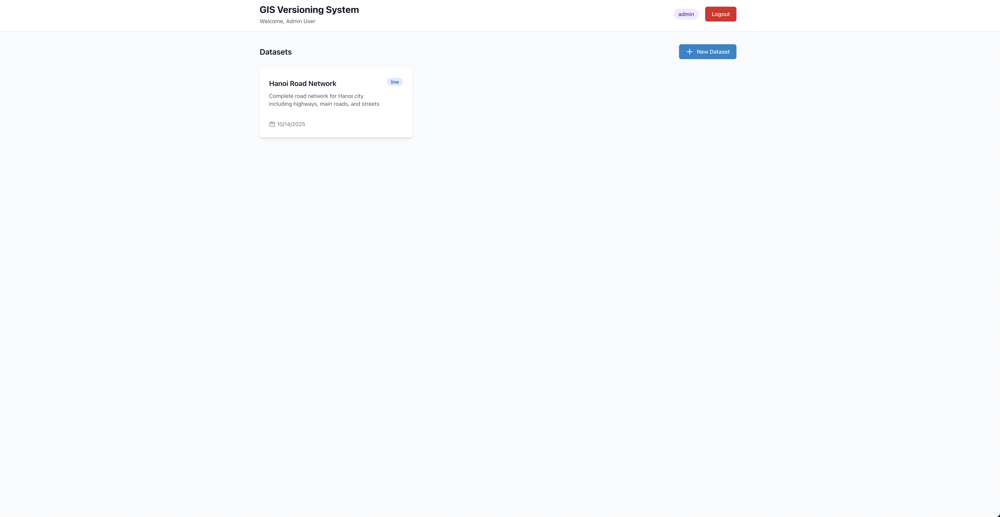
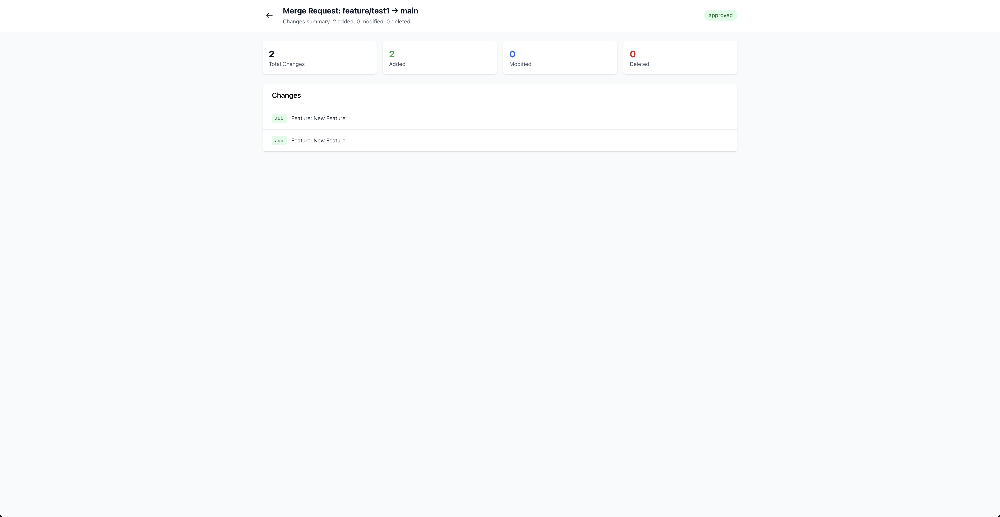

<h1 align="center">GIS Versioning System</h1>
<p align="center">
    A Git-like version control system for geospatial data
</p>

<a name="table-of-contents"></a>

## Table of contents

- [Table of contents](#table-of-contents)
- [Description](#description)
- [Features](#features)
  - [Version Control](#version-control)
  - [Merge Requests](#merge-requests)
  - [Interactive Map Editor](#interactive-map-editor)
  - [Access Control](#access-control)
  - [Collaboration Features](#collaboration-features)
- [Installation](#installation)
  - [Requirements](#requirements)
  - [Clone the Project](#clone-the-project)
  - [Setup with Docker](#setup-with-docker)
- [Usage](#usage)
  - [Running the Application](#running-the-application)
  - [User Roles](#user-roles)
  - [Working with Branches](#working-with-branches)
  - [Creating Merge Requests](#creating-merge-requests)
  - [Resolving Conflicts](#resolving-conflicts)
- [API Documentation](#api-documentation)
  - [Datasets](#datasets)
  - [Branches](#branches)
  - [Features](#features-1)
  - [Merge Requests](#merge-requests-1)
- [Tech Stack](#tech-stack)
  - [Backend](#backend)
  - [Frontend](#frontend)
  - [Database Schema](#database-schema)
- [Screenshots](#screenshots)
  - [Dashboard](#dashboard)
  - [Map Editor](#map-editor)
  - [Merge Request Detail](#merge-request-detail)
- [TODO](#todo)
- [License](#license)
- [Acknowledgments](#acknowledgments)

<a name="description"></a>

## Description

GIS Versioning System is a comprehensive web-based platform that brings Git-like version control capabilities to geospatial data management. It enables teams to collaboratively edit geographic features with full history tracking, branching, and merge conflict resolution.

Designed for organizations managing GIS datasets, the system provides a familiar workflow similar to modern version control systems while handling the unique challenges of geospatial data versioning.

<a name="features"></a>

## Features

### Version Control
- **Branch Management**: Create working branches from main branch for isolated feature development
- **Change Tracking**: Comprehensive tracking of all additions, modifications, and deletions
- **History Visualization**: View complete change history with detailed statistics
- **Main Branch Updates**: Check for changes in main branch while working on feature branches

### Merge Requests
- **Draft Mode**: Create merge requests as drafts for review before submission
- **Conflict Detection**: Automatic detection of concurrent modifications and deletions
- **Conflict Resolution**: Interactive resolution with multiple strategies:
  - Keep source (your changes)
  - Keep target (main branch)
  - Manual resolution
  - Smart property merging
- **Status Tracking**: Complete lifecycle from draft → reviewing → approved/rejected

### Interactive Map Editor
- **Drawing Tools**: Create points, lines, and polygons directly on the map
- **Edit Mode**: Move and reshape existing features
- **Property Management**: Add and edit custom properties for each feature
- **Real-time Visualization**: See changes immediately on the map

### Access Control
- **Role-Based Permissions**: Admin and Member roles with different capabilities
- **Branch Ownership**: Members can only edit branches they created
- **Protected Main Branch**: Only admins can modify the main branch
- **Merge Request Workflow**: Members create, admins approve

### Collaboration Features
- **Department Isolation**: Each department has isolated datasets
- **Conflict Warnings**: Proactive alerts about potential conflicts
- **Change Statistics**: Detailed breakdown of additions, modifications, and deletions
- **Merge Request Prevention**: Prevents duplicate merge requests from the same branch


<a name="installation"></a>

## Installation

<a name="requirements"></a>

### Requirements

- Docker 20.10+
- Docker Compose 2.0+

### Clone the Project

```bash
git clone https://github.com/Zyx-98/gis-versioning-system.git
cd gis-versioning-system
```

### Setup with Docker

Docker installation is the fastest way to get started. All services (frontend, backend, and database) will be set up automatically.

1. **Create environment file:**
```bash
# Create .env file in the root directory
cat > .env << EOF
VITE_API_BASE_URL=http://localhost:3000/api
EOF
```

2. **Start all services:**
```bash
docker-compose up -d
```

3. **Wait for services to be ready** (first run may take a few minutes):
```bash
docker-compose logs -f
```

4. **Access the application:**
   - Frontend: http://localhost:5173
   - Backend API: http://localhost:3000
   - Database: localhost:5432

5. **Initialize the database** (first time only):
```bash
# Run migrations
docker-compose exec server npm run migration:run

# Run seed
docker-compose exec server npm run db:seed
```

<a name="usage"></a>

## Usage

### Running the Application

After installation, simply start the Docker services:

```bash
docker-compose up -d
```

Then open your browser and navigate to `http://localhost:5173`

### User Roles

**Admin:**
- Create and manage datasets
- Approve/reject merge requests
- Edit main branch directly
- Manage all branches and features

**Member:**
- Create working branches
- Edit their own branches
- Create and submit merge requests
- View all datasets in their department

### Working with Branches

1. **Create a Branch:**
   - Navigate to a dataset
   - Click "Checkout Branch"
   - Enter a branch name (e.g., `feature/update-roads`)
   - Click "Checkout"

2. **Edit Features:**
   - Open the branch in Map Editor
   - Use drawing tools to add features
   - Click existing features to edit properties
   - Enable Edit Mode to move/reshape features
   - Click "Save Changes" to persist modifications

3. **Track Changes:**
   - View change statistics in the legend
   - Check for main branch updates
   - See detailed change list before creating merge requests

### Creating Merge Requests

1. Click "Create MR" button (only available if no active MR exists)
2. Review change summary:
   - Number of added features
   - Number of modified features
   - Number of deleted features
3. Add a description of your changes
4. Click "Create Merge Request"
5. Submit for admin review when ready

### Resolving Conflicts

If conflicts are detected:

1. **View Conflicts:**
   - Navigate to your merge request
   - Review the list of conflicting features
   - Click on individual conflicts for details

2. **Resolution Options:**
   - **Keep Mine**: Use your changes
   - **Keep Theirs**: Use main branch version
   - **Auto-resolve All**: Resolve all conflicts with one strategy
   - **Manual**: Edit and create custom resolution

3. **Submit for Review:**
   - Once all conflicts are resolved
   - Click "Submit for Review"
   - Wait for admin approval


## API Documentation

The API follows RESTful principles with the following main endpoints:

### Datasets
- `POST /api/datasets` - Create dataset (Admin only)
- `GET /api/datasets` - List all datasets
- `GET /api/datasets/:id` - Get dataset details
- `GET /api/datasets/:id/branches` - List branches
- `GET /api/datasets/:id/merge-requests` - List merge requests

### Branches
- `POST /api/branches/checkout` - Create new branch
- `GET /api/branches/:id` - Get branch details
- `DELETE /api/branches/:id` - Delete branch (Creator only)
- `GET /api/branches/:id/features` - List features
- `GET /api/branches/:id/changes` - Get change summary
- `GET /api/branches/:id/check-updates` - Check main branch updates
- `GET /api/branches/:id/can-edit` - Check edit permissions
- `GET /api/branches/:id/has-active-merge-request` - Check for active MR

### Features
- `POST /api/branches/:id/features` - Add feature
- `PUT /api/branches/:branchId/features/:featureId` - Update feature
- `DELETE /api/branches/:branchId/features/:featureId` - Delete feature

### Merge Requests
- `POST /api/merge-requests` - Create merge request
- `GET /api/merge-requests/:id` - Get merge request details
- `PUT /api/merge-requests/:id` - Update description
- `POST /api/merge-requests/:id/submit-for-review` - Submit for review
- `POST /api/merge-requests/:id/cancel` - Cancel merge request
- `POST /api/merge-requests/:id/approve` - Approve (Admin only)
- `POST /api/merge-requests/:id/reject` - Reject (Admin only)
- `GET /api/merge-requests/:id/changes` - Get changes
- `GET /api/merge-requests/:id/conflicts` - Get conflicts
- `POST /api/merge-requests/:id/conflicts/auto-resolve` - Auto-resolve conflicts

<a name="tech-stack"></a>

## Tech Stack

### Backend
- **Framework**: NestJS (Node.js)
- **Database**: PostgreSQL with PostGIS extension
- **ORM**: TypeORM
- **Authentication**: JWT (JSON Web Tokens)
- **Validation**: class-validator
- **API Documentation**: Swagger/OpenAPI

### Frontend
- **Framework**: Vue.js 3 (Composition API)
- **State Management**: Pinia
- **Routing**: Vue Router
- **HTTP Client**: Axios
- **Map Library**: Leaflet with Leaflet.draw
- **Styling**: Tailwind CSS
- **Build Tool**: Vite

### Database Schema
- Users & Departments
- Datasets with geometry types
- Branches with status tracking
- Features with PostGIS geometry
- Merge Requests with conflict tracking
- Feature Changes with before/after snapshots

<a name="screenshots"></a>

## Screenshots

### Dashboard
Main dashboard showing all datasets in the department.


### Map Editor
Interactive map editor with drawing tools and feature editing capabilities.


### Merge Request Detail
Detailed view of merge request with conflict resolution interface.


<a name="todo"></a>

## TODO

- [ ] **Enhanced Conflict Resolution**
  - [ ] Side-by-side geometry comparison viewer
  - [ ] Visual diff for geometry changes
  - [ ] Property-level merge interface

- [ ] **Branch Management**
  - [ ] Branch merging (pull changes from main to working branch)
  - [ ] Branch comparison view
  - [ ] Stale branch detection and cleanup

- [ ] **Collaboration Features**
  - [ ] Comments on merge requests
  - [ ] @mentions and notifications
  - [ ] Activity feed
  - [ ] Email notifications

- [ ] **Advanced Features**
  - [ ] Bulk operations (import/export)
  - [ ] CSV/GeoJSON import
  - [ ] Shapefile support
  - [ ] Time-travel feature (view data at specific point in time)
  - [ ] Audit log

- [ ] **Performance**
  - [ ] Pagination for large datasets
  - [ ] Lazy loading for features
  - [ ] Database query optimization

- [ ] **Testing**
  - [ ] Unit tests for backend services
  - [ ] Integration tests for API endpoints
  - [ ] Performance benchmarking

- [ ] **Documentation**
  - [ ] Better documentation

- [ ] **Deployment**
  - [ ] Kubernetes manifests
  - [ ] CI/CD pipeline
  - [ ] Production configuration guide

<a name="license"></a>

## License

This project is licensed with the [MIT license](LICENSE).

---

## Acknowledgments

- [Leaflet](https://leafletjs.com/) - Interactive maps
- [Leaflet.draw](https://github.com/Leaflet/Leaflet.draw) - Drawing tools
- [PostGIS](https://postgis.net/) - Spatial database
- [NestJS](https://nestjs.com/) - Backend framework
- [Vue.js](https://vuejs.org/) - Frontend framework
